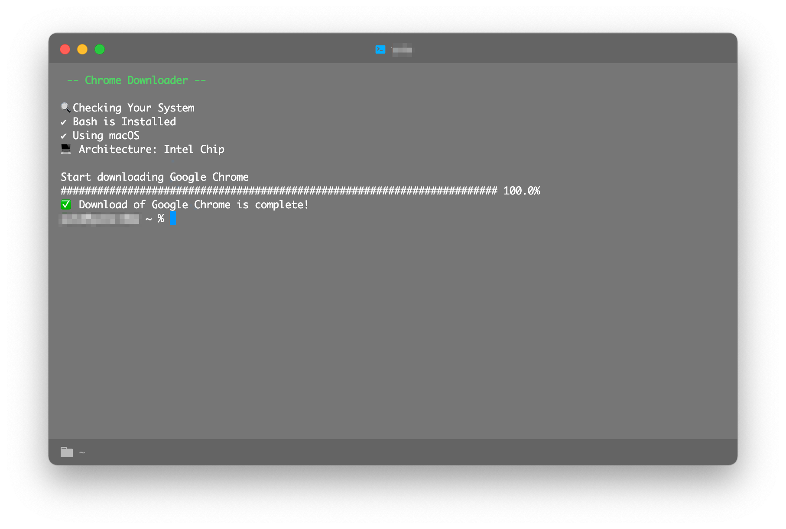

# chrome-downloader

[](https://github.com/Luke-1220/chrome-downloader/blob/master/LICENSE)



> Shell script to download Google Chrome without Safari

This is a simple shell script to download Google Chrome without using Safari.

Currently, only macOS is supported.

This script will determine if your PC is equipped with an Intel chip or Apple Silicon and download the appropriate `.dmg` installer file.

Browsers other than Chrome (e.g. Firefox, Edge, Vivaldi, Opera) do not provide static direct download links and are not supported at this time.

## Usage

### use script hosted on my website

This method is easy to remember the URL, but the version may not be up-to-date because it is not linked to this git repository.

```shell
$ curl -s https://fus1.one/crdl.sh | bash
```

### use script hosted on GitHub

This method gets the script from this git repository, so it is up-to-date, but the URL may be somewhat hard to remember.

```shell
$ curl -s https://raw.githubusercontent.com/Luke-1220/chrome-downloader/master/crdl.sh | bash
```

## License

MIT